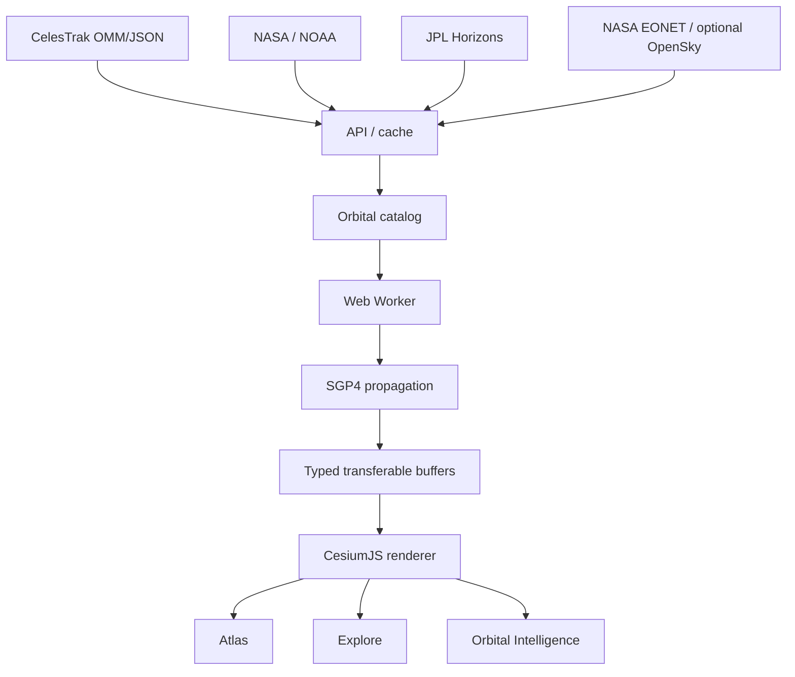

# Human Space Atlas

**Human Space Atlas (HSA)** é um atlas 3D web de objetos artificiais no espaço, combinando catálogo orbital, visualização científica, contexto terrestre e uma camada de exploração cinematográfica.

O projeto foi desenhado com uma separação explícita entre **dados observados**, **posições calculadas a partir de elementos orbitais** e **reconstruções visuais**. Essa distinção é parte da arquitetura, não apenas um aviso de interface.

## Em 30 segundos

- visualização 3D em **CesiumJS**;
- catálogo orbital via **CelesTrak OMM/JSON**;
- propagação **SGP4** usando `satellite.js` em Web Worker;
- renderização em escala com `PointPrimitiveCollection` e buffers transferíveis;
- NASA/NOAA para fenômenos terrestres e clima espacial;
- JPL Horizons para vetores heliocêntricos de missões profundas;
- previsão de passagens, reentry watch e close-approach screening não operacional;
- cache stale-while-revalidate para resiliência das fontes externas;
- testes com Vitest e Playwright.

## Arquitetura



## Integridade científica

| O que aparece no HSA | O que representa |
|---|---|
| posição orbital animada | propagação SGP4 calculada a partir de elementos orbitais públicos, não telemetria direta |
| nuvens / aurora | dados observacionais usados para orientar uma reconstrução visual, não geometria 3D medida diretamente |
| conjunction screening | triagem geométrica baseada em catálogo público, não probabilidade operacional de colisão |
| re-entry watch | sinais derivados de elementos públicos; o sistema não fabrica horário de reentrada |
| catálogo carregado | subconjunto de objetos públicos conhecidos; não implica cobertura de objetos classificados ou não catalogados |

## Estado atual

### Atlas orbital

- CesiumJS 3D Earth com múltiplos estilos de mapa;
- ingestão CelesTrak OMM/JSON pela API do projeto;
- propagação SGP4 em Web Worker;
- buffers transferíveis tipados e densidade adaptativa determinística;
- renderização em lote com `PointPrimitiveCollection`;
- busca, filtros, inspeção de objeto selecionado e trilha orbital;
- relógio de simulação e tracking sincronizado;
- Cesium World Terrain quando configurado, com fallback de elevação ArcGIS;
- eventos terrestres NASA EONET e contexto opcional de aeronaves OpenSky.

### Earth Experience

- NASA GIBS Cloud Fraction para distribuição macro de nuvens;
- NASA MODIS Cloud Top Height para altitude observada;
- NASA MODIS Cloud Optical Thickness como sinal de densidade;
- nuvens volumétricas limitadas no Explore, separadas do mapa estável de campo distante;
- handoff das nuvens volumétricas antes de ~360 km;
- rejeição de amostras malformadas ou não finitas antes de chegar ao Cesium;
- NASA VIIRS night lights com transição após estabilização dos tiles;
- NOAA SWPC OVATION para aurora;
- iluminação orbital com luz solar, penumbra/eclipses e atmosfera aprimorada.

### Explore

- nave fictícia HSA Explorer, separada conceitualmente dos objetos reais;
- controles de voo 6DOF-style, throttle/boost, órbita/zoom de câmera e presets;
- drift cinematográfico quando não há entrada do usuário;
- sincronização com objeto real selecionado para observação;
- sem armas, combate, economia ou XP.

### Renderer e streaming

- ancestrais coarse de imagery são aquecidos antes da ativação do provider;
- providers aquecidos são reutilizados ao alternar estilos;
- warm-up é limitado e adaptado a dispositivos restritos/data-saver;
- Explore prefetches uma vizinhança 3x3 à frente da câmera;
- VIIRS espera estabilidade do globo antes de aparecer;
- coleções internas do Cesium não são monkey-patched para transições;
- matriz de QA visual em [`docs/EARTH-VISUAL-QA.md`](docs/EARTH-VISUAL-QA.md).

## Orbital Intelligence

Abra **INTEL** no canto inferior esquerdo da aplicação.

Recursos atuais:

- previsão de passagens nas próximas 24 horas;
- presets NASA Deep Space Network e ESA ESTRACK;
- geolocalização do navegador para observador local;
- close-approach screening explicitamente marcado como não operacional;
- orbital-decay / re-entry watch usando mean motion, eccentricity, BSTAR e `DECAY_DATE` quando disponível;
- registro curado de missões deep-space;
- vetores heliocêntricos via NASA/JPL Horizons;
- mapa logarítmico do Sistema Solar com órbitas de referência, velocidade heliocêntrica e distância relativa à Terra.

## Backend e cache

A API usa stale-while-revalidate em camadas:

1. memória do processo;
2. filesystem quando gravável;
3. Upstash Redis REST / Vercel KV-compatible REST opcional.

Quando uma fonte externa falha temporariamente, a API pode continuar servindo a última observação válida dentro da janela de retenção configurada.

## Stack

- React + TypeScript + Vite
- CesiumJS
- satellite.js / SGP4
- Node built-in HTTP/fetch API
- Vitest
- Playwright

## Quick start

Requisito: Node.js 22.13+.

```bash
cp .env.example .env
npm install
npm run dev
```

UI: `http://localhost:5173`  
API local: `http://localhost:8787`

### Cesium ion opcional

```env
VITE_CESIUM_ION_TOKEN=your_public_read_token
```

Não coloque secrets de escopo privado em variáveis expostas ao browser.

### Cache remoto opcional

```env
UPSTASH_REDIS_REST_URL=
UPSTASH_REDIS_REST_TOKEN=
```

ou:

```env
KV_REST_API_URL=
KV_REST_API_TOKEN=
```

## Endpoints

```text
GET /api/health
GET /api/catalog?group=stations
GET /api/catalog?group=active
GET /api/catalog?group=starlink
GET /api/catalog?group=gps-ops
GET /api/earth/events
GET /api/space-weather/aurora
GET /api/aircraft/states
GET /api/horizons?command=<JPL_COMMAND>&start=2026-08-16&stop=2026-08-17&step=1%20h
```

## Validação

```bash
npm test
npm run typecheck
npm run check:server
npm run build
```

Com o servidor de desenvolvimento em execução:

```bash
npm run smoke:earth
```

Screenshots de smoke são gravados em `artifacts/earth-smoke/`.

## Princípios de dados

1. preferir contratos OMM/JSON modernos a suposições TLE-only;
2. preservar metadados de fonte e observação;
3. cachear upstreams e usar a última observação válida durante falhas temporárias;
4. nunca chamar posição propagada de telemetria direta;
5. não apresentar reconstrução cinematográfica como geometria observada;
6. não apresentar screening público como collision probability operacional;
7. não sugerir cobertura total de objetos físicos ou classificados.

Veja [`docs/ROADMAP.md`](docs/ROADMAP.md) para as próximas fases.

## Licença

MIT para o código deste repositório. Dados, imagens e APIs externas mantêm seus próprios termos e requisitos de atribuição.
